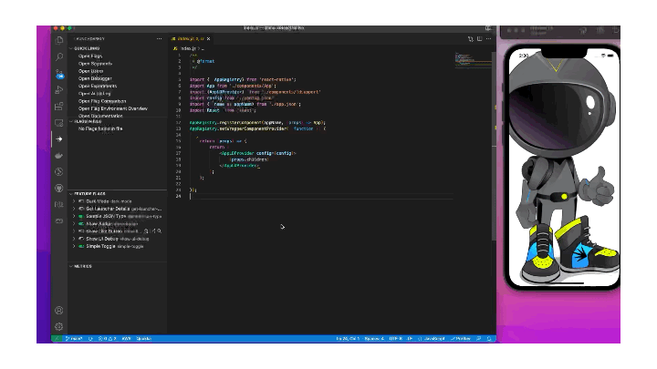

# README
Simple React Native application using LaunchDarkly feature flags.


## Requirements
SDK version compatibility
The [LaunchDarkly React Native SDK](https://docs.launchdarkly.com/sdk/client-side/react/react-native) is compatible with Xcode 12.2 or higher and React Native 0.64 or higher.

## Installation
1. Install NodeJS Packages
```
demoLDReactNative> npm install
```

2. Install LaunchDarkly pods in the ios directory.
This SDK requires Xcode 12.2 or higher and compiles against Swift 5.
```
demoLDReactNative> cd ios
ios> pod install
```
### Create LaunchDarkly Project using Terraform (Optional)
This demo uses the following feature toggle:

```
// AppToggles in ldsupport.js

    "get-launcher-details":{
            "backgroundImage": "toggle_new.png",
            "heroImage": "toggle_new.png",
            "heroName": "toggle"
    },
    "show-like-button": false,
    "show-ui-debug":false
    

```    

1. Change directory to `terraform/development`

```
demoLDReactNative> cd terraform/development
```

2. You will need a LaunchDarkly **Access token** before proceeding. See this [doc](https://docs.launchdarkly.com/home/account-security/api-access-tokens) on how to create one.

3. Update the `terraform.tfvars`  with your LaunchDarkly **access token** and **project name**. 

```
access_token="<YOUR ACCESS TOKEN FOR TERRAFORM>"
project_name="Demo React Native"
project_key="demo-react-native"
```
4. Run **terraform**
```
demoLDReactNative/terraform/development> terraform init
demoLDReactNative/terraform/development> terraform apply
```


## Running the IOS application

1. Copy `config.json.tmpl` to `config.json`
2. Edit the `config.json` with your **Mobile SDK Key**

```
{
    "mobileKey": "<Mobile SDK Key>",
    "userKey": "user1tester.com" // test user key
  }

```

3. Start the IOS + Metro.

```
demoLDReactNative> npm run ios

```


